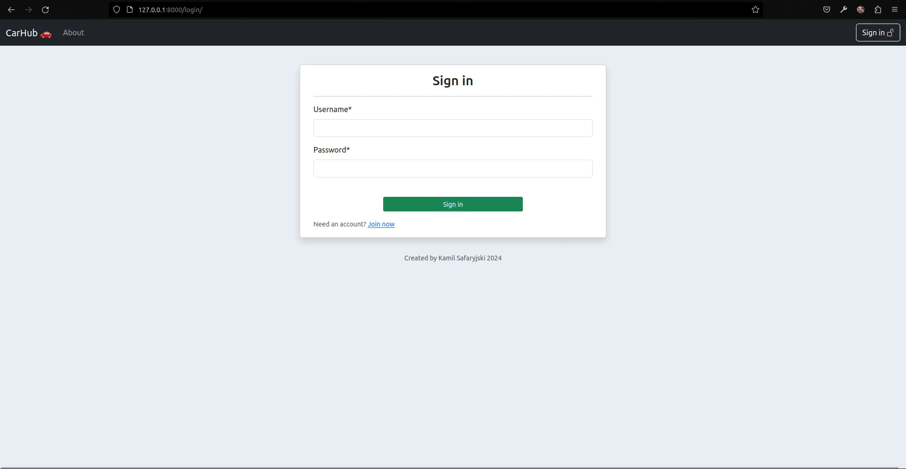
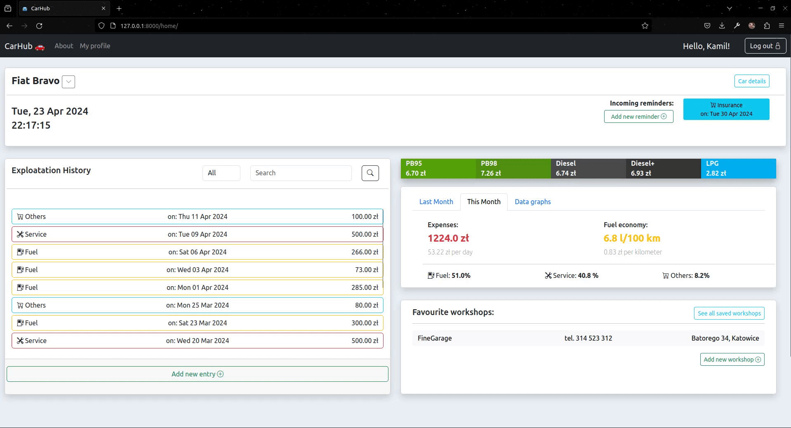
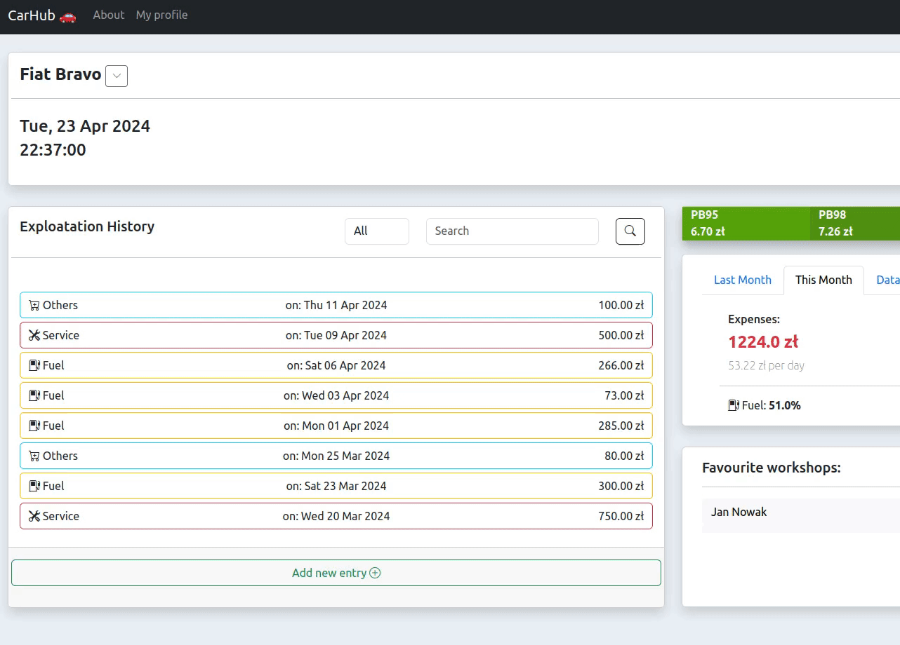

# Overview

Web application powered by Python and Django framework, which aims to help vehicle keep track of refueling, performed repaires and any other kind of expenses related to cars.

This application was created as a practical part of a bachelor's thesis.

<p align="center"></p>

# How to run:

1. Create virtual environment and activate it:

        virtualenv venv
        cd venv/bin
        source activate

2. Install dependencies by running:

        pip install -r requirements.txt

3. Go to ```/car_management_app/settings.py``` and provide your PostgreSQL database connection credentials:

        DATABASES = {
            'default': {
                'ENGINE': 'django.db.backends.postgresql_psycopg2',
                'NAME': '< YOUR DATABASE NAME >',
                'USER': '< YOUR DATABASE USER NAME >',
                'PASSWORD': '< YOUR DATABASE PASSWORD >',
                'HOST': '< YOUR DATABASE HOST ADDRESS >',
                'PORT': '< YOUR DATABASE PORT >'
            }
        }

4. Go to the main project directory and run migration command:

        python manage.py migrate

3. Run application with command when in main project directory:

        python manage.py runserver


# Features:

- Profile creation,
- **Adding/editing/deleting** cars to the profile,
- **Saving/editing/deleting** workshops data to the profile
- **Creating/editing/deleting** entries with containing expense type, details, cost etc.
- **Creating/editing/deleting** reminders about upcoming important events like insurance or repairs,
- Monthly reports about vehicle exploitation, containing average fuel consumption, expenses and incurred costs structure,
- Graphic reports in form of graphs, visualising exploitation data (costs, mileage, fuel consumption),
- System for monitoring current fuel prices


# Technologies and tools used:

- Python 3.10,
- PostgreSQL,
- HTML,
- JavaScript,
- JQuery 3.6.0,
- Bootstrap5 5.3.0,


# GIFs

<p align="center"></p>

<p align="center"></p>

<p align="center"></p>

<p align="center"></p>

<p align="center"></p>

<hr>

Kamil Safaryjski 2024

